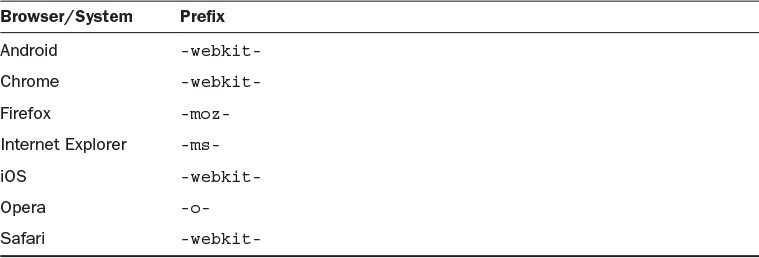
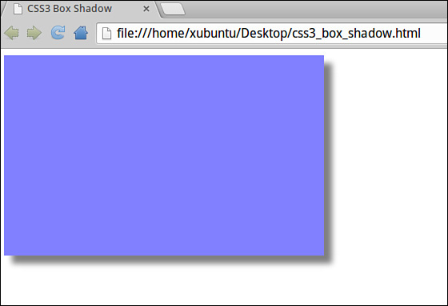
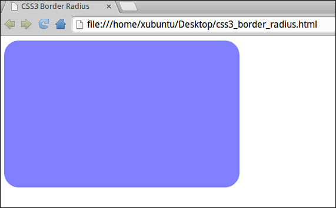

# Hour 13 Training #

## Introducing CSS3 ##

#### What You’ll Learn in This Hour: ####
> * Some of the new abilities CSS3 brings to CSS</li>
> * Using vendor-specific prefixes and extensions</li>
> * Cross-browser setting of CSS3 properties</li>
> * Setting CSS3 properties efficiently in JavaScript</li>

In this hour you’ll get a flavor of what CSS3 can do for your web pages, and
you’ll see how to effectively control CSS3’s capabilities using JavaScript.

Using CSS3 you can easily achieve plenty of cool new effects without having to
use lots of JavaScript code and/or external graphics applications such as
Photoshop. You can create rounded borders, add shadows to boxes, use an image as
a border, and more. CSS3 contains several new background properties that give
you more control over background elements, including multiple background
images, while CSS3 gradients let you display smooth transitions between two or
more specified colors. New text features include text shadows and word wrap, as
well as easy use of web fonts. And CSS3 lets you easily build really cool
transitions, transformations, and animations.


## Vendor Specific Properties and Prefixes ##
CSS vendor prefixes are a way for the browser companies to add support for new
or experimental CSS features before they become part of the formal CSS3
specification, or to implement features of a specification that hasn’t yet been
finalized. In due course, these prefixes usually become unnecessary as the
features become fully supported via their standard CSS3 nomenclature. To make
sure that your pages render as you want them to in the maximum number of
browsers, though, it pays to use prefixes.

The CSS3 browser prefixes you’re likely to need appear in Table 13.1.

    
TABLE 13.1 Vendor Prefixes for CSS3

In most cases, where a prefix is necessary you take the CSS3 property as listed
in the CSS3 specification and add the relevant prefix from Table 13.1 for the
browser in use. For example, later in this hour you’ll read about CSS3
transitions. There you’ll see that, if you want to add a CSS3 transition to
your page, you use the `transition` property with the prefixes added first:

#### Tip

>At the time of writing there’s a really useful roundup of which feature/browser
combinations require a prefix at
[http://shouldiprefix.com/](http://shouldiprefix.com/).
>
>For a frequently updated list of which features are supported by a particular
browser and version, visit
[http://www.w3schools.com/cssref/css3_browsersupport.asp](
http://www.w3schools.com/cssref/css3_browsersupport.asp).

`-webkit-transition: background 0.5s ease;`

`-moz-transition: background 0.5s ease;`

`-o-transition: background 0.5s ease;`

`transition: background 0.5s ease;`

The user’s browser will respond to whichever version of the transition feature
it understands, ignoring the rest.

Thankfully, browser manufacturers are working hard at fully implementing all of
the CSS3 features, and for most modern browsers the number of properties requiring a pre
fix is falling quickly.

## CSS3 Borders ##

CSS3 lets you do some really cool things with borders that were only previously
possible with lots of ugly, hard-to-maintain code hacks.

In this section we’ll look at two examples: box shadows and rounded corners.

### Create Box Shadows

The box-shadow property lets you add drop shadows to your page’s box elements.
As Table 13.2 shows, you can separately specify values for color, size, blur,
and offset:


TABLE 13.2 Parameters for the box-shadow Property

Here’s an example using a 10px-wide shadow heading down and to the right,
blurred across its full width, and colored mid-grey:
```
  #div1 {
    background-color: #8080ff;
    width: 400px;
    height: 250px;
    box-shadow: 10px 10px 10px #808080;
    -webkit-box-shadow: 10px 10px 10px #808080;
    -moz-box-shadow: 10px 10px 10px #808080;
  }
```

In Figure 13.1 you can see an example of this style applied to a element in a
web page.



FIGURE 13.1 A CSS3 box shadow

### Rounding Corners with the border-radius property
The `border-radius` property lets you add rounded corners to your page
elements without the need for specially created corner images, and is
perhaps one of the most popular features new to CSS3.

The `border-radius` property already has widespread browser support, though
Mozilla Firefox required the `-moz-` prefix for a little longer than some of its
rivals; therefore, if you need to support Firefox back several versions you
should consider including the prefixed version too:

```
    #div1 {
      -moz-border-radius: 25px;
      border-radius: 25px;
    }
```
In Figure 13.2 you can see an example of a element styled with radiused corners.



FIGURE 13.2 A CSS3 border radius

Rounded corners can be specified independently using the individual properties
`border-bottom-left-radius`, `border-top-left-radius`,
`border-bottom-right-radius`, and `border-bottom-right-radius`, or for all four
corners in one statement by using the `border-radius` property, as we’ve done
here.

#### Caution

>The prefixed version of a property might not always be exactly the same as the
property as described in the CSS3 specification.
>
>Even though vendor-specific extensions usually avoid conflicts (as each vendor
has a unique prefix), please remember that such extensions may also be subject
to change by the vendor, as they do not form part of the CSS3 specifications,
even though they try to behave like the forthcoming CSS3 properties.
>
>Remember, too, that the vendor-specific extensions will almost certainly fail
CSS validation.
